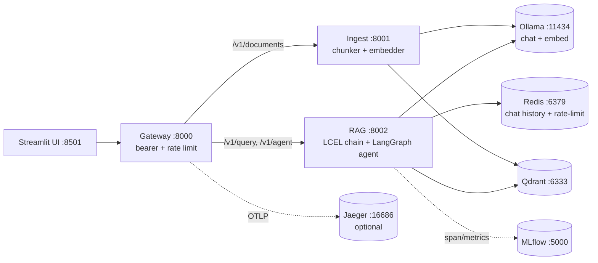

# sorakAi

**Local-first RAG + agent platform.** Three FastAPI services (gateway,
ingest, RAG) wired together with LangChain LCEL + LangGraph, a Qdrant
vector store, a Redis-backed chat history, OpenTelemetry tracing, an
MLflow callback, an evaluation harness, and a Streamlit chat UI. Ships
fully local against Ollama out of the box — no cloud LLM provider is
ever called by default.

```text
+---------+        +---------+        +-------+        +--------+
| Browser | -----> | Gateway | -----> |  RAG  | -----> | Ollama |
| (UI)    |        |  :8000  |        | :8002 |        | (chat) |
+---------+        +---------+        +-------+        +--------+
                       |                 |                 |
                       v                 v                 v
                   +--------+        +--------+        +--------+
                   | Ingest |        | Qdrant |        | Ollama |
                   |  :8001 | -----> | :6333  | <----- | (embed)|
                   +--------+        +--------+        +--------+
                       |
                       v
                   +-------+    +---------+
                   | Redis | -- | MLflow  |
                   | :6379 |    |  :5000  |
                   +-------+    +---------+
```



## Quickstart

```bash
git clone https://github.com/ZeeFcd/sorakAi.git && cd sorakAi
python3.12 -m venv ../sorakaienv && source ../sorakaienv/bin/activate
make install-dev

# Brings up compose, waits for /health on all three services, pulls
# Ollama models, ingests a sample corpus, fires a sample query.
make dev
# -> Gateway docs at http://127.0.0.1:8000/docs
```

Want the chat UI as well?

```bash
make install-ui && make ui
# Streamlit chat at http://127.0.0.1:8501 (or via compose --profile ui)
```

Want the eval harness?

```bash
make eval                         # chain
$(PY) scripts/eval.py --target agent --mlflow   # agent + MLflow run
```

## Environment

Linux-only. Tested on Python 3.12 (see `python:3.12-slim` in [Dockerfile](Dockerfile)).
Create and use a virtualenv (path is up to you; `make` defaults to
`../sorakaienv`):

```bash
python3.12 -m venv ../sorakaienv
source ../sorakaienv/bin/activate
make install-dev                              # runtime + tests + lint + hooks
make lint typecheck test openapi-check        # full pre-merge check
```

## Run services (dev)

The fast path is `make dev`. To run by hand:

```bash
uvicorn sorakai.ingest.app:app --reload --port 8001
uvicorn sorakai.rag.app:app --reload --port 8002
export INGEST_SERVICE_URL=http://127.0.0.1:8001 RAG_SERVICE_URL=http://127.0.0.1:8002
uvicorn sorakai.gateway.app:app --reload --port 8000
```

Set the same `REDIS_URL` on ingest and RAG when running as separate
processes.

The full provider matrix (LLM, embeddings, vector store, chat history)
and the 10-line template for plugging in a new adapter live in
[`docs/providers.md`](docs/providers.md). The version history lives in
[`CHANGELOG.md`](CHANGELOG.md).

### Fully local - never calls a cloud LLM provider

sorakAi only ships adapters for local Ollama (chat + embeddings) and a deterministic
test stub. There are no cloud SDKs in `requirements.txt` and no `OPENAI_*` env vars.
The architecture is provider-pluggable behind LangChain's `BaseChatModel` and
`Embeddings` interfaces, so swapping or adding a host is one new file plus one
registry entry - see "Adding a new provider" below.

| Layer | Default provider | Env knob | Notes |
|-------|------------------|----------|-------|
| Chat model | `ollama` | `LLM_PROVIDER`, `OLLAMA_BASE_URL`, `OLLAMA_CHAT_MODEL` | Tests flip `LLM_PROVIDER=stub` via conftest. |
| Embeddings | `ollama` | `EMBEDDING_PROVIDER`, `OLLAMA_BASE_URL`, `OLLAMA_EMBEDDING_MODEL` | `EMBEDDING_PROVIDER=char` gives offline pseudo-vectors for tests. |

Local dev: `ollama serve`, `ollama pull llama3.2:1b`, `ollama pull nomic-embed-text`,
then the RAG / ingest services Just Work with their defaults.

**Dim-guard (Wave 2).** The KB stamps the `{provider, model, dim}` triple it was
built with into `sorakai:kb:meta` on first ingest. Every later ingest and every
query is verified against that triple; a mismatch returns **`409 Conflict`** with
a JSON body explaining `expected` vs `actual`. The fix is either to re-ingest the
corpus with the current provider/model, or to POST `/v1/documents` again with
`replace_kb: true` (which atomically clears the chunks and the meta record).
This replaces the silent zero-padding that used to mask cross-model vector
arithmetic.

### Ollama embeddings tuning

The Ollama adapter (`sorakai/infra/embeddings/ollama.py`) is batched and
concurrent. Defaults are sensible for a single-host setup; the knobs:

| Env | Default | What it does |
|-----|---------|--------------|
| `OLLAMA_EMBED_BATCH` | `64` | Max inputs per `/api/embed` request body. |
| `OLLAMA_EMBED_CONCURRENCY` | `4` | Max in-flight embed requests (bounded by an asyncio.Semaphore). |
| `OLLAMA_EMBED_TIMEOUT_SECONDS` | `60.0` | Per-request timeout, separate from the gateway proxy timeout. |
| `OLLAMA_EMBED_USE_BATCH_ENDPOINT` | `true` | Set to `false` to force the legacy per-input `/api/embeddings` (older Ollama). The adapter also falls back automatically on a 404. |

Empty / whitespace-only chunks are filtered before the network call and
zero-vectors are reinserted at the original indices, so the returned list
always aligns 1:1 with the input list.

### Adding a new provider

The factories live under `sorakai/infra/llm/` and `sorakai/infra/embeddings/` and
are tiny:

```python
# sorakai/infra/llm/<your_provider>.py
from langchain_<your_provider> import Chat<YourProvider>
from sorakai.common.config import Settings
from sorakai.infra.llm.base import BaseChatModel

def build_<your_provider>_chat(settings: Settings) -> BaseChatModel:
    return Chat<YourProvider>(model=settings.<your_provider>_chat_model, ...)
```

```python
# sorakai/infra/llm/factory.py  (add one line)
from sorakai.infra.llm.<your_provider> import build_<your_provider>_chat
CHAT_MODEL_REGISTRY["<your_provider>"] = build_<your_provider>_chat
```

Then extend `LLMProvider = Literal["ollama","stub",...]` in `sorakai/common/config.py`
and you're done; no chain, agent, ingest, or RAG handler touches the change.

> For the full template (including embeddings and vector stores) plus
> the registered-adapter table, see [`docs/providers.md`](docs/providers.md).

### Chunker (Wave 3)

`POST /v1/documents` runs the content through a LangChain
`RecursiveCharacterTextSplitter` (`sorakai/common/ingest.py`). Splitter
selection is language-aware:

| Hint | Splitter |
|------|----------|
| `mime_type=text/x-python` or `filename=*.py / *.pyi` | `RecursiveCharacterTextSplitter.from_language(Language.PYTHON)` (keeps `def` / `class` / blocks intact when possible) |
| `mime_type=text/markdown` or `filename=*.md / *.markdown / *.mdx` | `from_language(Language.MARKDOWN)` (prefers heading + paragraph boundaries) |
| anything else | generic recursive splitter (newlines -> sentences -> words -> chars) |

`mime_type` wins over `filename` so explicit caller intent beats guessing.
Adding a new language is one entry in each of `_FILENAME_LANGUAGE_MAP` and
`_MIME_LANGUAGE_MAP` plus one in `_LANGUAGE_STRATEGY`.

Request knobs (see `DocumentIngestRequest`):

| Field | Default | Notes |
|-------|---------|-------|
| `chunk_size` | `500` | Hard limit per chunk; bounded `[50, 10_000]`. |
| `chunk_overlap` | `50` | Characters shared between neighbouring chunks; must be strictly `< chunk_size` (Pydantic validator enforces it). |
| `mime_type` | `null` | Optional override for splitter selection; charset parameters (e.g. `; charset=utf-8`) are stripped before lookup. |

Stored chunks carry `{doc_id, filename, chunk_index, chunk_total, mime}` for
downstream filtering / attribution. Reads tolerate legacy entries that
predate the `chunk_total` + `mime` fields (Wave 3 onwards) - missing fields
read as `-1` / `null` respectively.

### Document API (Wave 4)

Beyond `POST /v1/documents`, the ingest service exposes:

| Method | Path | Purpose |
|--------|------|---------|
| `GET` | `/v1/documents` | List every document in the KB with `chunk_count` and `mime`. |
| `DELETE` | `/v1/documents/{doc_id}` | Drop every chunk for that document; returns the count removed. 404 if unknown. |

The gateway proxies both as `/api/v1/documents` and `/api/v1/documents/{doc_id}`.

Re-ingest semantics: `POST /v1/documents` with an existing `document_id`
**atomically replaces** that document's chunks (Redis pipeline pairs
`HDEL ck:<doc_id>:*` with the new `HSET`). No duplicates, no half-written state.

`replace_kb=true` runs the same atomicity contract at the whole-KB level
(single `MULTI`/`EXEC` of `DEL sorakai:kb:chunks` + `HSET` of the new doc),
and only after the chunks land does the dim-guard meta get rewritten. If the
meta swap fails for any reason, the next request gets a clean 409 instead of
the silent corruption the meta-first ordering used to produce.

### Vector store (Wave 5)

`sorakai/infra/vector_store/` exposes the same factory pattern as the LLM /
embeddings layers: callers depend on the `VectorStore` Protocol and pick a
backend with `VECTOR_STORE`.

| `VECTOR_STORE` | Backend | Notes |
|----------------|---------|-------|
| `memory` *(test default)* | `KnowledgeStoreVectorStore(InMemoryKnowledgeStore())` | Single-process; resets on restart. |
| `redis` *(prod default)* | `KnowledgeStoreVectorStore(RedisKnowledgeStore(REDIS_URL))` | Same Wave 4 hash layout (`ck:<doc_id>:<chunk_index>`). |
| `qdrant` | `QdrantVectorStore` | Real ANN backend; collection per env (`QDRANT_COLLECTION`, default `sorakai_kb`), cosine distance, payload carries the Wave 3 chunk metadata. |

The Protocol surface is intentionally small:

```python
class VectorStore(Protocol):
    async def upsert(self, docs: list[VectorDoc]) -> None: ...
    async def delete_doc(self, doc_id: str) -> int: ...
    async def list_docs(self) -> list[DocSummary]: ...
    async def search(self, query_vec, k, filters=None) -> list[Hit]: ...
    async def ping(self) -> bool: ...
    async def aclose(self) -> None: ...
```

Re-ingesting the same `doc_id` overwrites cleanly on every backend (Wave 4
contract carried into the Protocol). For Qdrant we drop any existing points
matching `doc_id` before upserting the new batch so a smaller re-ingest
doesn't orphan tail chunks.

#### Adding a new vector store

1. Drop an adapter file under `sorakai/infra/vector_store/<name>.py` that
   satisfies the Protocol.
2. Add the backend literal to `VectorStoreBackend` in `sorakai/common/config.py`.
3. Register a builder in `sorakai/infra/vector_store/factory.py`:
   ```python
   VECTOR_STORE_REGISTRY["milvus"] = _build_milvus
   ```
4. Add it to the `vstore` matrix in `tests/test_vector_store.py` — the
   behavioural matrix runs every test against every backend automatically.

#### Running Qdrant locally

```bash
docker compose up -d qdrant
# then point ingest + rag at it:
VECTOR_STORE=qdrant QDRANT_URL=http://127.0.0.1:6333 make dev
```

In tests the `qdrant-client` library supports the in-process `":memory:"`
transport (`AsyncQdrantClient(":memory:")`) so the suite exercises the real
Qdrant code path without needing a running server.

### Storage (Redis, Wave 4 layout)

Chunks are stored under a single hash `sorakai:kb:chunks`. Each field is named
`ck:<doc_id>:<chunk_index>` (Wave 4) so:

- Re-ingesting the same `doc_id` only writes the new fields and `HDEL`s the
  stale tail (or zero fields if the chunk count grows) — never duplicates.
- `DELETE /v1/documents/{doc_id}` is a single `HSCAN` + multi-field `HDEL`.
- Listing is one `HGETALL` plus an in-process group-by.
- Reads tolerate pre-Wave-4 `ck:<uuid>` keys (and infer `chunk_total` from
  siblings sharing the same `doc_id`), so live KBs survive an upgrade.

Other Redis keys used by the project:

- `sorakai:kb:meta` — the dim-guard identity hash (`provider`, `model`, `dim`).
- `sorakai:chat:<session_id>` — per-session chat history (see `sorakai/common/chat_history.py`).

Retrieval still loads all chunk vectors into the RAG process and runs cosine
similarity (fine for small / medium KBs). For large corpora or ANN search,
swap the storage backend out via the Wave 5 `VectorStore` Protocol
(Qdrant / Milvus / pgvector / Redis Search-VECTOR / Pinecone / …) and keep
Redis as a metadata + cache layer.

### RAG chain (Wave 6)

`POST /v1/query` now runs through an LCEL chain assembled in
`sorakai/chains/rag_chain.py`. The chain **never** imports a concrete
provider; it asks the factories the same way every other Wave 1+ entry
point does. Swapping providers is one env var:

```bash
LLM_PROVIDER=ollama EMBEDDING_PROVIDER=ollama make dev   # local prod
LLM_PROVIDER=stub   EMBEDDING_PROVIDER=char    pytest     # tests
```

Pipeline (returned by `build_rag_chain(settings, vector_store, chat_store)`):

```
{question, session_id?}
   │  RunnableWithMessageHistory injects "history" from chat_store
   ▼
inner = retriever → prompt(system + history + user) → llm → {"answer", "context", "sources_used"}
   │
   ▼ persists (user turn, AI answer) back to chat_store
{answer, context, sources_used}
```

The handler turns that dict into the existing `/v1/query` response
(`answer`, `context_preview`, `sources_used`, `session_id`).

#### Retrieval

Set in `sorakai/common/config.py`:

| Setting                       | Default | Effect                                             |
| ----------------------------- | ------- | -------------------------------------------------- |
| `RAG_TOP_K`                   | `5`     | Chunks fed to the prompt (after fusion + rerank).  |
| `HYBRID_RETRIEVER_ENABLED`    | `true`  | BM25 (`rank-bm25`) + vector via RRF.               |
| `HYBRID_BM25_WEIGHT`          | `0.4`   | RRF weight on the BM25 ranking.                    |
| `HYBRID_VECTOR_WEIGHT`        | `0.6`   | RRF weight on the vector ranking.                  |
| `RERANK_TOP_N`                | `20`    | Cap on the fused list before optional reranker.    |
| `RERANKER_ENABLED`            | `false` | Wave 6 ships a no-op reranker hook (`NoopReranker`); a real `bge-reranker-base` loader lands in a future wave. |

BM25 is built lazily on the first query — so "seed corpus, then ask"
works without rebuild plumbing. After a large ingestion in a long-running
service, call `await app.state.retriever.arebuild()` (or restart) so BM25
sees the new chunks. Wave 8 wires this hook automatically.

#### Chat history

`RunnableWithMessageHistory` reads/writes per-session memory through the
Wave 1 `RedisChatHistoryStore` (or `InMemoryChatHistoryStore`) via the
`SorakaiChatMessageHistory` adapter in `sorakai/chains/history.py`. The
async path is canonical; sync getters fall back to `asyncio.run` when
called outside an event loop and raise inside one (so the chain never
deadlocks itself).

### Agent graph + streaming (Wave 7)

`POST /v1/agent` runs a LangGraph `StateGraph` defined in
`sorakai/chains/agent_graph.py`. The graph self-corrects (rewrite on a
weak grade, retry on a bad critique) so the agent is more robust than the
straight `/v1/query` chain for off-topic or under-specified questions.

```
start ──▶ route ──┬── kb ──▶ retrieve ──▶ grade ──┬── good ──▶ generate ──▶ critique ──┬── ok ──▶ END
                  │                                │                                     │
                  │                                └── weak ──▶ rewrite ─┐               └── retry ──▶ rewrite ─┐
                  │                                                       │                                      │
                  │                                                       └──▶ retrieve (loop)                  └──▶ retrieve (loop)
                  │
                  └── chitchat ──▶ generate ──▶ critique (skipped) ──▶ END
```

Three tools live in `sorakai/chains/tools.py` behind a tiny `ToolRegistry`:

| Tool         | Purpose                                                                                |
| ------------ | -------------------------------------------------------------------------------------- |
| `kb_search`  | Wraps the Wave 6 retriever; the same retrieval surface the LCEL chain uses.            |
| `calc`       | AST-walking safe arithmetic evaluator with an exponent cap (no `eval`, no attribute access). |
| `web_search` | Stubbed off by default (`WEB_SEARCH_ENABLED=false`); enabled-without-provider raises so misconfiguration fails loudly. |

Settings:

| Setting               | Default | Effect                                                                                |
| --------------------- | ------- | ------------------------------------------------------------------------------------- |
| `AGENT_MAX_STEPS`     | `4`     | Hard cap on retrieve/rewrite loops; the graph short-circuits to the best answer after.|
| `WEB_SEARCH_ENABLED`  | `false` | Flip to enable a future real provider behind the stub.                                |

Request shape (`AgentRequest`):

```json
{ "question": "where are the pyramids", "session_id": "user-7", "max_steps": 4 }
```

Response shape (`AgentResponse`):

```json
{
  "answer": "Pyramids are in Egypt.",
  "sources_used": 2,
  "session_id": "user-7",
  "route": "kb",
  "steps_used": 2,
  "trace": ["route", "retrieve", "grade", "generate", "critique"],
  "tool_calls": [
    {"name": "kb_search", "input": {"query": "pyramids", "k": 5}, "output_summary": "2 item(s)", "duration_ms": 14.2, "error": null}
  ]
}
```

#### Streaming (SSE)

Both the chain and the agent expose SSE variants — `POST /v1/query/stream`
and `POST /v1/agent/stream` — that emit one frame per node visit (agent)
or per LLM token (chain). The framing helper lives in
`sorakai/common/sse.py`; the gateway proxies stream bytes through
unmodified so callers can use a single base URL.

```bash
curl -N -X POST http://localhost:8082/api/v1/agent/stream \
  -H 'content-type: application/json' \
  -d '{"question":"where are the pyramids"}'
```

### Observability (Wave 8)

Three pillars wired in this wave: **OpenTelemetry tracing**,
**structured logs** through `structlog`, and a **LangChain MLflow
callback** that maps one chain / agent invocation onto one MLflow run.

#### OpenTelemetry

- `sorakai/common/telemetry.py` installs a global `TracerProvider` once
  per service from the FastAPI `lifespan`. `FastAPIInstrumentor` +
  `HTTPXClientInstrumentor` auto-instrument HTTP server + outbound calls;
  the handlers wrap chain/agent invocations in manual `span("rag.query")` /
  `span("agent.run")` blocks for first-class spans.
- Settings:

| Setting                         | Default            | Effect                                                                                       |
| ------------------------------- | ------------------ | -------------------------------------------------------------------------------------------- |
| `OTEL_ENABLED`                  | `true`             | Master switch; `false` makes every span a no-op.                                             |
| `OTEL_EXPORTER`                 | `console`          | `console` writes spans to stdout; `otlp` ships gRPC to a collector.                          |
| `OTEL_EXPORTER_OTLP_ENDPOINT`   | _unset_            | Setting this implicitly flips `OTEL_EXPORTER` to `otlp` (default in compose is `http://jaeger:4317`). |
| `OTEL_SERVICE_NAME`             | per-service name   | Resource `service.name`; override for multi-tenant deployments.                              |
| `OTEL_SAMPLER_RATIO`            | `1.0`              | Parent-based `TraceIdRatioBased` sampler; lower in prod (e.g. `0.05`).                       |

- Optional Jaeger in `docker-compose.yml` (UI at <http://127.0.0.1:16686>):

```bash
docker compose --profile otel up --build
```

#### Structured logs

`sorakai/core/logging.py` configures `structlog` with the stdlib bridge,
so `logger.info("foo %s", x)` from sorakai code and `uvicorn` /
`opentelemetry` / `mlflow` stdlib loggers all render identically.
JSON renderer in containers (`LOG_FORMAT=json`, default), tinted console
on a TTY (`LOG_FORMAT=console`).

Every log line carries:

- `event`, `level`, `logger`, `timestamp`,
- `request_id` (bound from the FastAPI middleware via
  `bind_request_id` / `clear_request_context`),
- `trace_id` / `span_id` when emitted inside an OTel span (free
  log <-> trace correlation in Grafana, Loki, etc.).

#### MLflow chain callback

`sorakai/common/mlflow_callback.py:MlflowChainCallback` is a
`langchain_core.callbacks.BaseCallbackHandler` that observes every LLM,
retriever, and tool call inside one chain / agent run, then logs the
aggregate metrics to MLflow on chain end. The `RAG` handler builds one
callback per request and passes it through `RunnableConfig`:

| Metric                          | What it counts                                                              |
| ------------------------------- | --------------------------------------------------------------------------- |
| `llm_calls`, `llm_latency_ms_total` | LLM invocations + total wall-clock latency.                              |
| `llm_call_<N>_latency_ms`           | Per-call latency for the first `MAX_PER_CALL_METRICS` (default 10) calls.|
| `tokens_total`                      | Sum of `token_usage.total_tokens` when the LLM surfaces it.              |
| `retrievals`, `docs_retrieved`      | Retriever invocations + total chunks returned.                           |
| `retrieval_latency_ms_total`        | Aggregate retriever latency.                                             |
| `tool_calls`, `tool_latency_ms_total` | Tool invocations (agent only).                                         |
| `answer_len`                        | Length of the final answer string.                                       |

The callback opens an MLflow run on first `on_chain_start`, closes it on
the matching root `on_chain_end`, and silently no-ops when
`MLFLOW_TRACKING_URI` is unset or `MLFLOW_CALLBACK_ENABLED=false`.

### Evaluation (Wave 9)

The eval harness drives a small golden Q/A set (`tests/eval/golden.jsonl`,
~16 cases) through either the LCEL chain or the LangGraph agent, scores
each case with a pure-Python scorer, and prints a compact summary. It is
the single source of regression truth for prompt + retriever changes.

| Piece                          | Location                                  |
| ------------------------------ | ----------------------------------------- |
| Golden Q/A set                 | `tests/eval/golden.jsonl`                 |
| Corpus (6 markdown files)      | `tests/eval/corpus/*.md`                  |
| Dataset loader + corpus reader | `sorakai/eval/dataset.py`                 |
| Scorer (in-tree, no LLM judge) | `sorakai/eval/scorer.py`                  |
| Runner (chain or agent)        | `sorakai/eval/runner.py`                  |
| CLI                            | `scripts/eval.py`                         |
| Optional CI job                | `.github/workflows/ci.yml::eval` (`workflow_dispatch` + `run_eval=true`) |

Each golden row carries `expected_substrings` (matched against the
answer in either `any` or `all` mode) and `expected_doc_ids` (used by
`context_precision_at_k`). The scorer also exposes a `pass_rate`
aggregate — the share of cases whose answer covered the expected
substrings — which doubles as the CI regression gate via
`--min-pass-rate`.

```bash
# Run the chain against the in-tree golden set. Defaults to the
# providers picked from .env (i.e. Ollama for a local dev box).
python scripts/eval.py --target chain

# Iterate on a single agent prompt without waiting for the full set.
python scripts/eval.py --target agent --limit 3 --min-pass-rate 0

# Archive the per-case results + log to MLflow.
python scripts/eval.py --target chain --json out/eval.json --mlflow
```

Exit codes: `0` on success, `1` when `pass_rate` or
`mean_context_precision_at_k` falls below the configured threshold, `2`
on argument / dataset usage errors. The CLI prints one row per case
followed by an aggregate summary; the JSON dump includes the answer,
retrieved doc ids, per-case latency, and the raw scorer extras for
later analysis.

Optional `ragas` extra: install `pip install ragas` and
`maybe_score_with_ragas` (currently a no-op stub) becomes the seam
where a full ragas-based scoring pass can land in a future wave without
breaking the CLI or runner signatures.

### Gateway hardening (Wave 10)

The gateway is the only authenticated edge of the stack. The three
shared middleware lanes live in `sorakai.common.middleware`
(`install_common_middleware`) and the gateway-specific bearer auth +
rate limiter live in `sorakai.common.security`
(`install_gateway_security`).

| Setting                  | Default | Effect                                                                 |
| ------------------------ | ------- | ---------------------------------------------------------------------- |
| `GATEWAY_API_KEY`        | _unset_ | When set, every `/v1/*` and `/api/v1/*` call needs `Authorization: Bearer <key>`. Unset = open. |
| `REQUEST_MAX_BYTES`      | `10485760` (10 MiB) | Hard cap on inbound bodies (applies to every service). `0` disables. |
| `RATE_LIMIT_PER_MINUTE`  | `0`     | Per-IP request budget on the gateway. `0` disables; any positive value enables `slowapi`. |
| `RATE_LIMIT_BURST`       | `20`    | Short-window burst allowance on top of the per-minute budget.          |
| `REDIS_URL`              | _unset_ | When set on the gateway, the rate limiter uses Redis storage; otherwise in-memory. |

Health and readiness probes (`/health`, `/ready`) stay unauthenticated
so liveness/readiness checks don't need credentials.

### URL surface consolidation (Wave 10)

Wave 10 makes `/v1/*` the **canonical** gateway surface. The pre-Wave-10
`/api/v1/*` paths still resolve - they're served as
`308 Permanent Redirect` responses (RFC 7538 preserves both the method
and the body, so POSTs forwarded by curl/httpx clients keep working).
The deprecation window is one release; new integrations should target
`/v1/*` directly.

| Surface          | Status                                            |
| ---------------- | ------------------------------------------------- |
| `GET /health`    | Unauthenticated, present on every service.        |
| `GET /ready`     | Unauthenticated, gateway-only.                    |
| `/v1/*`          | Canonical paths, guarded by bearer + rate limit.  |
| `/api/v1/*`      | 308 redirect to `/v1/*`, hidden from OpenAPI.     |

### Chat UI (Wave 10)

A minimal Streamlit chat front-end lives under `ui/`. It talks to the
gateway exclusively (no direct access to ingest/RAG) so the same
front-end works against a locked-down deployment with
`GATEWAY_API_KEY` set.

```bash
# Streamlit is an *optional* extra - the runtime services don't need it.
pip install -r requirements-ui.txt
make ui              # or: streamlit run ui/streamlit_app.py
```

Or via docker-compose:

```bash
docker compose --profile ui up --build  # exposes the UI at :8501
```

See `ui/README.md` for the full feature/config table.

## OpenAPI

- **Versioned specs**: `openapi/*.openapi.json` (CI-checked) and optional `*.openapi.yaml` — regenerate with `python scripts/export_openapi.py --yaml --output openapi`.
- **Runtime**: each service serves `GET /openapi.json` and `/docs`; Docker images also expose **`GET /openapi.bundled.json`** and **`GET /openapi.bundled.yaml`** from the files baked at build (`OPENAPI_DIR`, default `/app/openapi`).
- Details: **`openapi/README.md`**.

## Docker

```bash
docker compose up --build
```

Includes **Ollama**, **MLflow** (UI at **http://127.0.0.1:5000**), Redis, ingest, RAG (Ollama + `MLFLOW_TRACKING_URI`), and gateway. On first start, **`ollama-model`** pulls **`llama3.2:1b`** (can take a few minutes). Use another small model:

```bash
OLLAMA_MODEL=phi3:mini docker compose up --build
```

